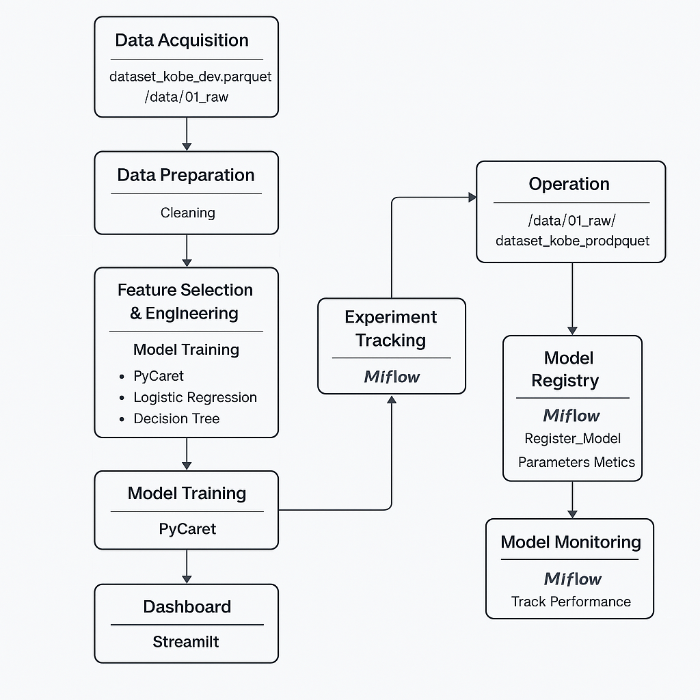

<<<<<<< HEAD
# **PD Engenharia de Machine Learning [25E1_3] :: Professor Felipe Fink Grael :: 03/04.2025**

## **Desafio**

Este projeto faz parte da avaliação final do curso de Engenharia de Machine Learning, cujo objetivo é aplicar conceitos aprendidos ao longo das aulas em um projeto completo, do início ao fim. A proposta é desenvolver um sistema preditivo capaz de estimar a probabilidade de acerto ou erro dos arremessos feitos por Kobe Bryant, astro da NBA conhecido como "Black Mamba".

## **Questão 1: 
A solução criada nesse projeto deve ser disponibilizada em repositório git e disponibilizada em servidor de repositórios (Github (recomendado), Bitbucket ou Gitlab). O projeto deve obedecer o Framework TDSP da Microsoft (estrutura de arquivos, arquivo requirements.txt e arquivo README - com as respostas pedidas nesse projeto, além de outras informações pertinentes). Todos os artefatos produzidos deverão conter informações referentes a esse projeto (não serão aceitos documentos vazios ou fora de contexto). Escreva o link para seu repositório.

Repositório GitHub: [https://github.com/alberto-alvarenga/pd-25E1_3](https://github.com/alberto-alvarenga/pd-25E1_3)

## **Questão 2: 
Iremos desenvolver um preditor de arremessos usando duas abordagens (regressão e classificação) para prever se o "Black Mamba" (apelido de Kobe) acertou ou errou a cesta.
Baixe os dados de desenvolvimento e produção aqui (datasets: dataset_kobe_dev.parquet e dataset_kobe_prod.parquet). Salve-os numa pasta /data/01_raw na raiz do seu repositório.
Para começar o desenvolvimento, desenhe um diagrama que demonstra todas as etapas necessárias para esse projeto, desde a aquisição de dados, passando pela criação dos modelos, indo até a operação do modelo.

## **Questão 3: Como as ferramentas Streamlit, MLFlow, PyCaret e Scikit-Learn auxiliam na construção dos pipelines descritos anteriormente?**

As ferramentas utilizadas ao longo do projeto – Streamlit, MLflow, PyCaret e Scikit-learn – desempenham papéis fundamentais em cada etapa do ciclo de vida do modelo de Machine Learning. A integração dessas ferramentas permitiu não apenas a construção eficiente dos pipelines, mas também o rastreamento, manutenção e disponibilização do modelo em produção.

#### Rastreamento de experimentos
Começando pelo rastreamento de experimentos, o MLflow foi essencial para registrar cada execução dos modelos treinados. Com ele, foi possível armazenar os parâmetros utilizados, as métricas de desempenho e os artefatos gerados, como gráficos e arquivos .pkl dos modelos. Isso facilitou a comparação entre diferentes versões de modelos e permitiu uma gestão eficiente dos resultados obtidos. A integração com o PyCaret também simplificou esse processo, já que a ferramenta possui suporte nativo ao MLflow, possibilitando o auto-logging dos experimentos.

#### Funções de treinamento
Nas funções de treinamento, utilizei o PyCaret como ferramenta principal por sua capacidade de automatizar tarefas comuns de Machine Learning, como pré-processamento de dados, comparação de múltiplos algoritmos, tunagem de hiperparâmetros e exportação dos modelos. Ele se mostrou especialmente útil para testes rápidos e consistentes durante o desenvolvimento. Já o Scikit-learn foi utilizado como base para a construção de modelos mais específicos e customizados, como a regressão logística, que exigiu maior controle sobre os hiperparâmetros e a lógica de treinamento.

#### Monitoramento da saúde do modelo
Para o monitoramento da saúde do modelo, utilizei uma combinação entre MLflow e Streamlit. O MLflow serviu como backend de armazenamento das métricas históricas dos modelos e suas versões, enquanto o Streamlit foi empregado para a criação de um painel de visualização. Através dessa interface, foi possível acompanhar o desempenho do modelo em tempo real, visualizar as previsões realizadas e analisar métricas como acurácia, precisão e matriz de confusão. Essa etapa é importante para garantir que o modelo continue operando de forma satisfatória ao longo do tempo.

#### Atualização de modelo
A atualização do modelo foi realizada a partir da ingestão de novos dados de produção, presentes no dataset dataset_kobe_prod.parquet. Ao aplicar novamente os pipelines de pré-processamento e treinamento com esses dados, foi possível treinar novas versões do modelo e reavaliar seu desempenho. Os modelos atualizados foram registrados novamente no MLflow, permitindo versionamento completo. Tanto o PyCaret quanto o Scikit-learn foram utilizados nesse processo de reentrenamento, garantindo flexibilidade e agilidade.

#### Provisionamento (Deployment)
O provisionamento do modelo em produção foi realizado com o uso do Streamlit. A ferramenta permitiu desenvolver uma aplicação web simples e funcional, onde usuários podem carregar dados, visualizar previsões e interpretar os resultados do modelo. Essa interface facilitou o acesso ao modelo por stakeholders e usuários finais, eliminando a necessidade de conhecimento técnico para utilizar a solução. A aplicação pode ser hospedada em servidores locais ou em nuvem, tornando o modelo acessível em ambientes reais.

## **Questão 4: Aponte os artefatos que serão criados ao longo de um projeto. Para cada artefato, a descrição detalhada de sua composição.**

Durante o desenvolvimento do modelo preditivo de arremessos de Kobe Bryant, foi realizada uma análise criteriosa das colunas disponíveis no dataset original. O objetivo foi selecionar as variáveis com maior relevância para a predição da variável alvo shot_made_flag, garantindo um modelo robusto, interpretável e eficiente.

### **Features utilizadas no projeto
As seguintes colunas foram selecionadas e utilizadas como variáveis preditoras no pipeline:

Feature: lat	
Type: float	
Descrição: Latitude do local do arremesso na quadra

Feature: lon	
Type: float	
Descrição: Longitude do arremesso, indicando posição lateral

Feature: minutes_remaining	
Type: int	
Descrição: Minutos restantes no período da jogada

Feature: period	
Type: int	
Descrição: Período da partida (ex: 1º quarto, 2º, prorrogação)

Feature: playoffs	
Type: int	
Descrição: Indicador se o jogo era de playoffs (1) ou temporada regular (0)

Feature: shot_distance	
Type: int	
Descrição: Distância do arremesso até a cesta (em pés)

Feature: shot_made_flag	
Type: int
Descrição: Variável alvo: 1 se acertou o arremesso, 0 se errou

Essas variáveis foram escolhidas por sua relevância posicional e contextual, além de apresentarem alta completude e fácil interpretação. Elas também são todas estruturadas e numéricas, o que favorece a modelagem sem exigir pré-processamento adicional complexo.

### **Features não utilizadas no projeto
As colunas abaixo foram analisadas mas não foram incluídas no modelo, por apresentarem limitações como alta cardinalidade, redundância, ou pouca contribuição informativa direta.

Feature: shot_type	
Motivo da exclusão: Informação redundante com shot_distance

Feature: action_type	
Motivo da exclusão: Alta cardinalidade textual; requer encoding extenso

Feature: shot_zone_area	
Motivo da exclusão: Derivada das coordenadas lat e lng

Feature: team_id, team_name	
Motivo da exclusão: Valor constante (Los Angeles Lakers); sem valor preditivo

Feature: game_id, game_event_id	
Motivo da exclusão: IDs únicos; não contribuem para predição

Feature: game_date	
Motivo da exclusão: Poderia ser útil para sazonalidade, mas foi descartada por simplificação

Feature: matchup, opponent	
Motivo da exclusão: Texto com valor contextual, mas descartado para evitar introdução de viés

Feature: combined_shot_type	
Motivo da exclusão: Redundante com action_type e shot_distance

Feature: shot_zone_basic, shot_zone_range	
Motivo da exclusão: Altamente correlacionadas com shot_distance; removidas por simplicidade

A exclusão dessas variáveis permitiu um modelo mais enxuto e eficiente, especialmente importante ao utilizar ferramentas como PyCaret, onde a simplicidade das features melhora a performance e reduz o tempo de execução.

## **Questão 5: Implemente o pipeline de processamento de dados com o mlflow, rodada (run) com o nome "PreparacaoDados":**

### b) Ainda sobre essa seleção, qual a dimensão resultante do dataset?

Antes do processamento, o dataset original continha uma grande quantidade de colunas e registros, incluindo diversas variáveis irrelevantes para o objetivo da predição ou com alta incidência de valores ausentes. Após a seleção criteriosa de apenas seis colunas consideradas relevantes para a análise — lat, lon, minutes_remaining, period, playoffs e shot_distance — e a exclusão de todas as linhas com dados faltantes, o dataset foi significativamente reduzido. O resultado final foi um conjunto de dados mais enxuto e consistente, contendo 25.697 registros e 7 colunas (incluindo a variável alvo shot_made_flag). Essa transformação foi essencial para garantir a integridade e qualidade dos dados a serem utilizados no treinamento dos modelos, reduzindo ruído e aumentando a confiabilidade das análises.

Ao analisar a distribuição da variável alvo shot_made_flag no dataset filtrado, observa-se que há um ligeiro desbalanceamento entre as classes. A maioria dos registros corresponde a arremessos errados (classe 0), enquanto a minoria representa os arremessos convertidos (classe 1). Embora o desequilíbrio não seja extremo, ele é suficiente para exigir atenção durante o treinamento dos modelos, pois algoritmos de classificação tendem a favorecer a classe majoritária. Esse comportamento pode levar a uma alta acurácia aparente, mesmo que o modelo esteja errando nas previsões da classe minoritária, que é justamente a de maior interesse estratégico. Por isso, é recomendável monitorar métricas como precisão, recall e F1-score para cada classe, além de considerar técnicas como amostragem estratificada, balanceamento com oversampling (ex: SMOTE) ou aplicação de pesos no modelo. Essa compreensão da distribuição do target permite ajustes no pipeline de modelagem, garantindo uma avaliação mais justa e um desempenho mais robusto do preditor final.

### C) Explique como a escolha de treino e teste afetam o resultado do modelo final. Quais estratégias ajudam a minimizar os efeitos de viés de dados?

A separação entre treino e teste é um passo fundamental em qualquer projeto de Machine Learning, pois garante que o modelo seja avaliado com dados que ele nunca viu durante o treinamento. Isso permite medir sua capacidade de generalização. Neste projeto, a separação foi feita de forma aleatória e estratificada, preservando a proporção original das classes da variável alvo shot_made_flag tanto na base de treino quanto na de teste. Isso é importante para evitar que uma das classes fique sub-representada em uma das partes, o que poderia enviesar o modelo.

A escolha da amostragem estratificada é uma estratégia eficiente para lidar com desequilíbrio de classes e minimizar o risco de viés. Outras estratégias complementares incluem o uso de métricas balanceadas (como F1-score), reponderação das classes durante o treinamento e técnicas de oversampling ou undersampling, como SMOTE, especialmente quando o desbalanceamento é acentuado. Essas práticas ajudam a garantir que o modelo aprenda de forma justa e seja capaz de performar bem para ambas as classes, mesmo que uma delas ocorra com menor frequência.

## **Questão 6: Implementar o pipeline de treinamento do modelo com o MlFlow usando o nome "Treinamento"
a. Com os dados separados para treinamento, treine um modelo com regressão logística do sklearn usando a biblioteca pyCaret.
b. Registre a função custo "log loss" usando a base de teste
c. Com os dados separados para treinamento, treine um modelo de árvore de decisão do sklearn usando a biblioteca pyCaret.
d. Registre a função custo "log loss" e F1_score para o modelo de árvore.
e. Selecione um dos dois modelos para finalização e justifique sua escolha.

Resp.: Após o treinamento e avaliação de dois modelos — regressão logística e árvore de decisão —, optamos por selecionar a regressão logística como modelo final do projeto. A decisão foi baseada em duas métricas principais: log loss e F1-score, calculadas com base na base de teste. A regressão logística apresentou um valor de log loss inferior ao da árvore de decisão, indicando uma maior confiabilidade nas previsões probabilísticas do modelo. Além disso, seu F1-score se manteve competitivo, demonstrando um bom equilíbrio entre precisão e recall, mesmo em um problema com leve desbalanceamento de classes. Outro fator importante foi a simplicidade e interpretabilidade do modelo, características valiosas em contextos analíticos onde é necessário justificar o comportamento da predição com clareza. Por fim, a regressão logística também tende a ser menos suscetível a overfitting em relação a árvores de decisão, especialmente em bases com número moderado de atributos, como é o caso deste projeto.

Regressão Logística - Log Loss: 0.6788 | F1-Score: 0.5139
Árvore de Decisão   - Log Loss: 13.8354 | F1-Score: 0.5400

## **Questão 7: Modelo em produção**

### a) O modelo é aderente a essa nova base? O que mudou entre uma base e outra? Justifique.

Não. O modelo não está aderente à base de produção.

Fase	    |Log Loss	|F1-Score
---------------------------------
Treinamento	|0.6768	    |0.5262
Teste	    |0.6788	    |0.5139
Produção	|0.6293	    |0.0000

Embora o Log Loss em produção tenha sido inferior ao observado nas fases de treinamento e teste, o F1-score zerado indica que o modelo falhou completamente em prever a classe positiva. Isso revela uma falta de aderência à base de produção. A principal hipótese é que há um desequilíbrio severo ou mudança na distribuição da variável shot_made_flag, o que levou o modelo a prever apenas a classe majoritária (erros). Para mitigar esse problema, será necessário revisar a distribuição da base de produção, aplicar técnicas de balanceamento, e possivelmente re-treinar o modelo com dados mais atualizados e representativos.

Distribuição da variável 'shot_made_flag' na base de produção:
Classe 0: 67.07%
Classe 1: 32.93%

Essa é uma distribuição razoavelmente balanceada. Embora exista predominância da classe 0, a classe 1 representa quase 33% dos casos, o que é uma proporção suficiente para que o modelo aprenda e identifique corretamente.

No entanto, isso entra em conflito com o resultado obtido do modelo em produção: F1-Score igual a 0.000

O problema não está no desbalanceamento da base.️ O problema está no modelo que, provavelmente, aprendeu a prever apenas a classe 0 por causa de overfitting, ausência de ajuste de limiar, ou por limitações do próprio algoritmo com os dados atuais.

### b) Descreva como podemos monitorar a saúde do modelo no cenário com e sem a disponibilidade da variável resposta para o modelo em operação.

O monitoramento da saúde de um modelo em produção é essencial para garantir que ele continue gerando previsões confiáveis ao longo do tempo. Quando temos disponibilidade da variável resposta, é possível realizar um monitoramento supervisionado. Nesse caso, podemos calcular métricas de performance como acurácia, F1-score, Log Loss, AUC, entre outras, da mesma forma que na fase de teste. Isso permite comparar a performance do modelo em produção com a performance obtida no treino, identificando rapidamente sinais de degradação do desempenho, como conceito drift ou data drift.

Por outro lado, no cenário em que não temos a variável resposta disponível, precisamos recorrer ao monitoramento não supervisionado. Nesse caso, monitoramos a entrada dos dados em tempo real, verificando a distribuição estatística das variáveis preditoras e comparando com os dados usados no treinamento. Técnicas como monitoramento de desvio de média, histograma, KS-test, Jensen-Shannon Divergence ou Population Stability Index (PSI) ajudam a identificar se o comportamento dos dados mudou. Também é possível acompanhar as probabilidades previstas pelo modelo, analisando se a confiança das predições mudou ao longo do tempo (ex.: se o modelo passou a prever tudo com alta incerteza).

### c) Descreva as estratégias reativa e preditiva de retreinamento para o modelo em operação.

O retreinamento de modelos em produção é uma etapa fundamental para manter sua performance ao longo do tempo, especialmente diante de mudanças nos dados ou no ambiente operacional.

A estratégia reativa baseia-se na detecção de degradação da performance do modelo. Ou seja, o modelo é reavaliado periodicamente ou continuamente, e, ao se observar uma queda significativa em métricas como acurácia, F1-score, ou aumento no log loss, um processo de retreinamento é acionado. Essa abordagem depende da disponibilidade da variável resposta e funciona como um mecanismo de resposta a falhas. Também é comum configurar limiares de alerta: por exemplo, se o F1-score cair abaixo de 0.50, um retreinamento automático é iniciado. Embora eficaz, essa estratégia pode apresentar um certo atraso entre a degradação e a correção, especialmente em ambientes onde os rótulos demoram a ser disponibilizados.

A estratégia preditiva atua de forma proativa, utilizando sinais indiretos para prever a necessidade de retreinamento antes que a performance do modelo caia. Isso pode incluir o monitoramento contínuo de estatísticas dos dados de entrada, como mudanças de média, variância ou distribuição das variáveis. Quando se detecta um data drift, mesmo sem ter ainda os rótulos verdadeiros, o sistema pode agendar um retreinamento preventivo. Essa abordagem é muito útil em sistemas em tempo real ou quando os rótulos demoram para chegar. Em alguns casos, a estratégia preditiva também pode ser calendária, onde retreinamentos são programados com base em frequência de uso, sazonalidade ou janela temporal fixa (ex: mensalmente).

## **Questão 8: Implemente um dashboard de monitoramento da operação usando Streamlit.**

O dashboard de monitoramento foi implementado em Streamlit e pode ser acessado pelo script `dashboard_monitoramento.py`.  
Para fins de entrega, o resultado visual foi salvo em `/Docs/Dash Streamlit.pdf`, contendo:
- Métricas em produção (Log Loss, F1-Score)
- Matriz de confusão
- Histograma das probabilidades previstas
- Tabela de amostra com previsões

## **Conclusão

Este projeto permitiu aplicar, de forma prática, todos os conceitos abordados ao longo da disciplina de Engenharia de Machine Learning — desde a preparação de dados até o deploy e monitoramento em produção. Ainda que o modelo em produção não tenha alcançado o desempenho esperado na classe positiva, a análise crítica realizada demonstrou a importância do monitoramento contínuo e da reavaliação de variáveis e limiares de decisão. O aprendizado mais valioso foi compreender que engenharia de ML vai muito além de métricas — envolve garantir robustez, rastreabilidade e adaptabilidade em ambientes reais.
=======
# pd-25E1_3
>>>>>>> 7c6f22b752269f484aeaa62114c8e9d4b8011a81
